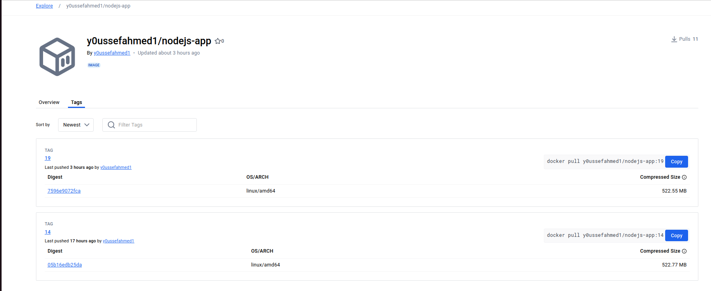
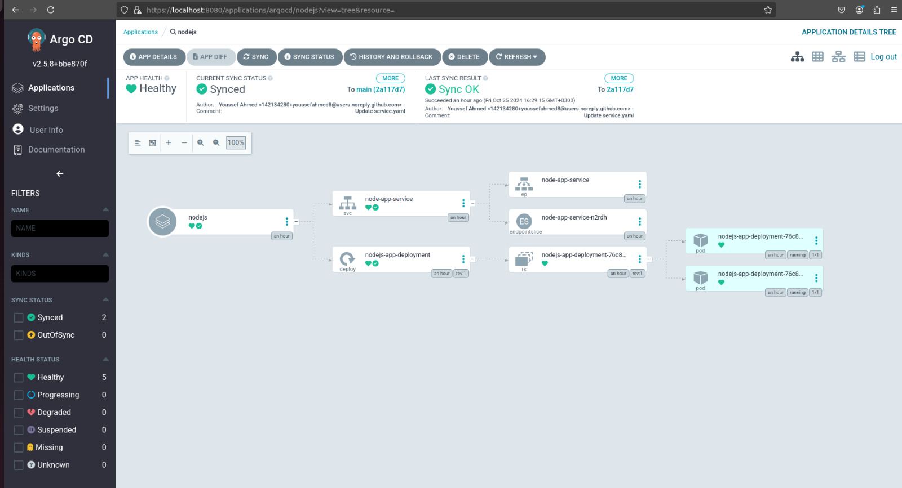

# This project deploys a Node.js application from the Node.js GitHub repository to a local Kubernetes cluster, using ArgoCD for continuous delivery and Jenkins for automated CI/CD. This setup streamlines deployment, ensuring efficient and reliable application delivery.

## Prerequisites

- Virtual Machine (VM) for Jenkins - Includes Docker installed.
- VM for Minikube - Installed with Minikube, kubectl, and ArgoCD.
- Required Accounts - GitHub and Docker Hub.

# Project Phases

## 1 Virtual Machine for Jenkins

- Install Docker on the Jenkins VM.

```bash
sudo apt update
sudo apt install curl
sudo curl -fsSL https://download.docker.com/linux/ubuntu/gpg | sudo gpg --dearmor -o /etc/apt/trusted.gpg.d/docker.gpg
sudo add-apt-repository "deb [arch=$(dpkg --print-architecture)] https://download.docker.com/linux/ubuntu $(lsb_release -cs) stable"
sudo apt update
sudo apt -y install lsb-release gnupg apt-transport-https ca-certificates curl software-properties-common
sudo apt -y install docker-ce docker-ce-cli containerd.io docker-compose-plugin docker-registry
sudo usermod -aG docker $USER
newgrp docker

```

- Install Jenkins on the Jenkins VM.

```bash

sudo wget -O /usr/share/keyrings/jenkins-keyring.asc https://pkg.jenkins.io/debian-stable/jenkins.io-2023.key

echo "deb [signed-by=/usr/share/keyrings/jenkins-keyring.asc]" https://pkg.jenkins.io/debian-stable binary/ | sudo tee /etc/apt/sources.list.d/jenkins.list > /dev/null

sudo apt update
sudo apt install fontconfig openjdk-17-jre -y
sudo apt install -y jenkins
sudo systemctl start jenkins
sudo systemctl status jenkins

Jenkins URL ====>>  http://Your-Machine-IP:8080

```

- Add Jenkins to docker group using `sudo usermod -aG docker jenkins` to allow machine access Docker

## Navigate To Jenkins create pipeline and install suggested plugins 
- Make Sure that `Docker` and `NodeJS` Plugins are installed

Create a Job and run Buildnow.


- Make sure that the Docker image pushed to Docker Hub


## Now VM for Minikube

- Install Minikube and kubectl on the second VM.

```bash

Install Kubernetes on Ubuntu/Debian 
#### Install Docker First if Installed Skip these steps
sudo apt update
sudo apt install curl
sudo curl -fsSL https://download.docker.com/linux/ubuntu/gpg | sudo gpg --dearmor -o /etc/apt/trusted.gpg.d/docker.gpg
sudo add-apt-repository "deb [arch=$(dpkg --print-architecture)] https://download.docker.com/linux/ubuntu $(lsb_release -cs) stable"
sudo apt update
sudo apt -y install docker-ce docker-ce-cli containerd.io docker-compose-plugin docker-registry 
sudo usermod -aG docker $USER
newgrp docker

######### Install MiniKube (kubernetes platform)
curl -LO https://storage.googleapis.com/minikube/releases/latest/minikube_latest_amd64.deb
ls
sudo dpkg -i minikube_latest_amd64.deb

minikube start --driver=docker --nodes=2
sudo snap install kubectl --classic
minikube kubectl -- get pods
kubectl cluster-info
kubectl get pods
minikube addons list
minikube dashboard &
kubectl get nodes
kubectl get pods -A

```

- Install ArgoCD on Minikube.

```bash

kubectl create namespace argocd
kubectl apply -n argocd -f https://raw.githubusercontent.com/argoproj/argo-cd/stable/manifests/install.yaml

to get password

kubectl -n argocd get secret argocd-initial-admin-secret -o jsonpath="{.data.password}" | base64 -d; echo

and portforward
kubectl port-forward svc/argocd-server -n argocd 8080:443

```

## Create Application On ArgoCD To automate your Application Deployment



## Make sure that the deployment created successfully


## Check the application 

